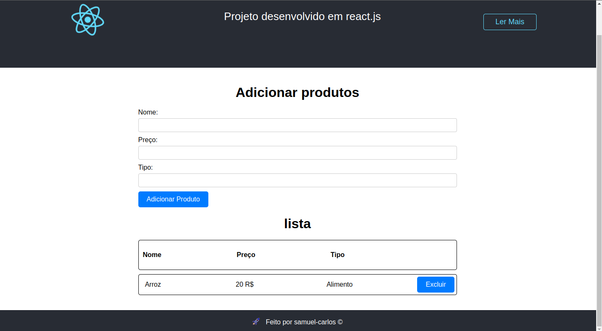

# Projeto lista de produtos

# Sobre o projeto

Este projeto foi desenvolvido com o objetivo de criar uma lista de produtos, utilizando o formato CRUD (Create, Read, Update, Delete). Com ele, é possível adicionar novos produtos à lista, visualizar os valores armazenados no banco de dados e realizar exclusões quando necessário. O banco de dados utilizado é o Firestore do Firebase. Para implementar esse projeto, foram utilizadas as tecnologias ReactJS e Firebase, que proporcionam uma experiência dinâmica e interativa ao usuário. Essas tecnologias permitem uma integração eficiente entre a interface do usuário e o banco de dados, tornando a criação, listagem e exclusão de produtos uma tarefa simplificada e eficaz.

## Introdução ao Create React App
Este projeto foi iniciado com o Create React App.

## Scripts Disponíveis
No diretório do projeto, você pode executar os seguintes comandos:

# npm start
Executa o aplicativo no modo de desenvolvimento.
Abra http://localhost:3000 para visualizá-lo no navegador.

A página será recarregada sempre que você fizer alterações.
Você também verá quaisquer erros de lint no console.

# npm test
Inicia o executor de testes no modo interativo.
Consulte a seção sobre execução de testes para obter mais informações.

# npm run build
Compila o aplicativo para produção na pasta build.
Ele agrupa corretamente o React no modo de produção e otimiza a compilação para obter o melhor desempenho.

A compilação é minificada e os nomes dos arquivos incluem os hashes.
Seu aplicativo está pronto para ser implantado!

Consulte a seção sobre implantação para obter mais informações.

# npm run eject
Observação: esta é uma operação unidirecional. Depois de fazer o "eject", você não pode voltar atrás!

Se você não estiver satisfeito com a ferramenta de compilação e as opções de configuração, você pode fazer o "eject" a qualquer momento. Esse comando removerá a única dependência de compilação do seu projeto.

Em vez disso, ele copiará todos os arquivos de configuração e as dependências transitivas (Webpack, Babel, ESLint, etc.) diretamente para o seu projeto, para que você tenha total controle sobre eles. Todos os comandos, exceto o "eject", ainda funcionarão, mas apontarão para os scripts copiados para que você possa ajustá-los. Neste ponto, você está por conta própria.

Você não precisa usar o "eject". O conjunto de recursos selecionados é adequado para implantações pequenas e médias, e você não deve se sentir obrigado a usar essa funcionalidade. No entanto, entendemos que essa ferramenta não seria útil se você não pudesse personalizá-la quando estiver pronto.

# Saiba Mais
Você pode aprender mais na documentação do Create React App.

Para aprender o React, consulte a documentação do React.

# Divisão de Código
Esta seção foi movida para https://facebook.github.io/create-react-app/docs/code-splitting

# Analisando o Tamanho do Pacote
Esta seção foi movida para https://facebook.github.io/create-react-app/docs/analyzing-the-bundle-size

# Criando um Progressive Web App
Esta seção foi movida para https://facebook.github.io/create-react-app/docs/making-a-progressive-web-app

